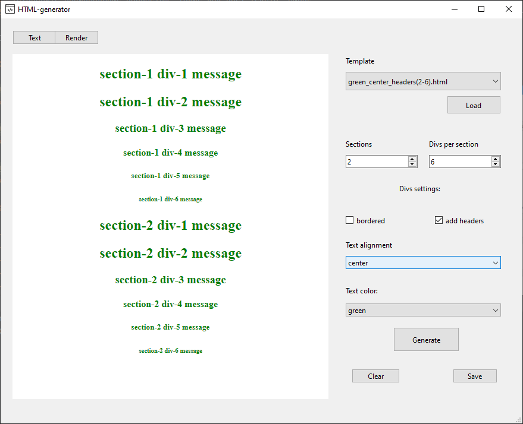
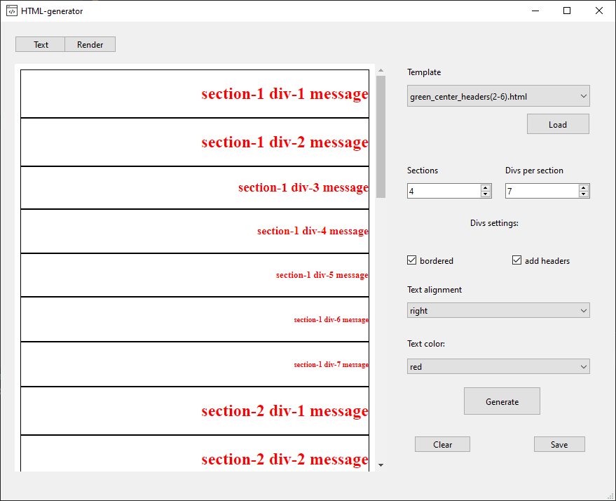
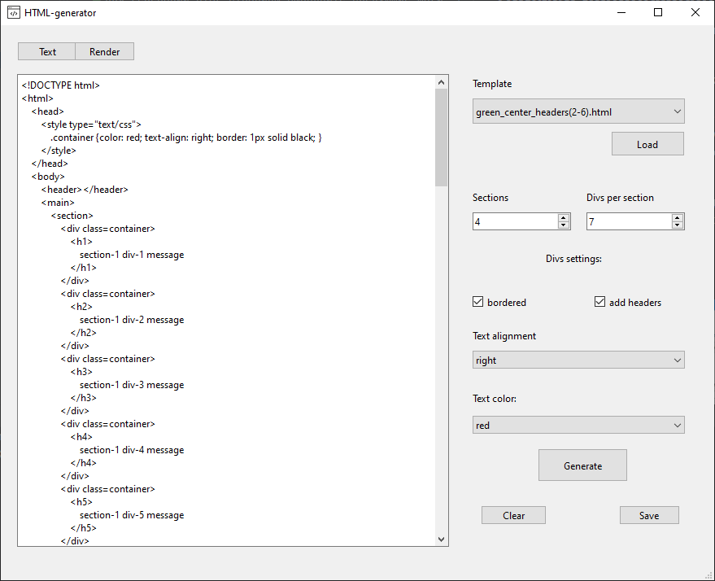

# HTML-generator

Этот проект представляет собой систему генерации HTML страниц на основе описания структуры. В рамках проекта реализованы несколько шаблонов проектирования программного обеспечения.

## Описание

Проект позволяет генерировать HTML страницы с заданной структурой, включающей различные разделы (header, section1, ... , section_n, footer) и блоки в каждом разделе. Также есть опциональная возможность выделять определенный раздел блок рамкой.

## Функциональные возможности

- Генерация HTML страницы на основе заданной структуры.
- Настройка количества разделов и блоков в каждом разделе.
- Опциональное выделение разделов блок рамкой.
- Вывод сгенерированного HTML кода в консоль.

## Используемые шаблоны проектирования

### Порождающие шаблоны

- **Строитель (Builder)**: Используется для пошагового создания сложных объектов. В данном проекте реализован в классе `HtmlBuilder`.
- **Фабричный метод (Factory Method)**: Используется для делегирования создания объектов подклассам. Реализован в методе `create_content` класса `HtmlBuilder`.

### Структурные шаблоны

- **Адаптер (Adapter)**: Преобразует интерфейс одного класса в интерфейс другого. Реализован в классе `HtmlAdapter`.
- **Легковес (Flyweight)**: Эффективно разделяет объекты на общие и индивидуальные части для экономии памяти. Реализован в классе `UniqueTag`.

### Поведенческие шаблоны

- **Стратегия (Strategy)**: Определяет семейство алгоритмов, которые могут быть взаимозаменяемыми. Реализован в классах `Strategy`, `Node` и `Leaf`.
- **Состояние (State)**: Позволяет объекту изменять свое поведение в зависимости от его состояния. Реализован в классе `HtmlBuilder` методом `to_previous`.

## Установка и запуск

### Требования

- Python 3.x
- PySide6

### Установка зависимостей

```bash
pip install poetry
cd project_path
poetry install
```

### Запуск

```bash
python main.py
```

## Известные проблемы

Для решения проблемы в Ubuntu, звучащей как:

```
qt.qpa.plugin: Could not load the Qt platform plugin "xcb" in "" even though it was found.
```

попробуйте использовать следующую команду:

```bash
sudo apt-get install '^libxcb.*-dev' libx11-xcb-dev libglu1-mesa-dev libxrender-dev libxi-dev libxkbcommon-dev libxkbcommon-x11-dev
```

## Пример использования

Для генерации HTML страницы выполните следующие шаги:

1. Укажите количество разделов и блоков в каждом разделе.
2. Установите опциональные параметры, такие как цвет текста, выравнивание и наличие рамки.
3. Нажмите кнопку "Сгенерировать", чтобы получить HTML код.

Сгенерированный HTML код будет выведен в текстовом редакторе приложения и может быть сохранен в файл.

## Скриншоты


*Главное окно приложения*


*Настройка параметров*


*Сгенерированный HTML код*

## Структура проекта

- `main.py`: Точка входа в приложение.
- `app.py`: Основной код GUI приложения.
- `html_utils.py`: Логика генерации HTML, включая реализацию шаблонов проектирования.
- `html_tags.py`: Определение HTML тегов и их атрибутов.
- `designed_ui/`: Дизайн интерфейса приложения.

## Лицензия

Этот проект лицензируется на условиях лицензии MIT. Подробности см. в файле `LICENSE`.


